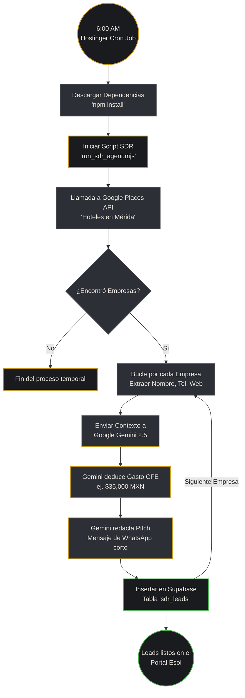

# Agente de Ventas Autónomo (AI SDR) - Esol Energías

El **SDR (Sales Development Representative) Autónomo** es un empleado digital diseñado para Esol Energías. Su objetivo es realizar prospección activa, perfilamiento energético y redacción de propuestas en frío (Cold Outreach) sin intervención humana.

---

## 🧠 Capacidades Principales

1. **Búsqueda Hiper-Segmentada:** 
   Se conecta a la API de Google Places para buscar empresas por giro comercial y región geográfica (ej. "Hoteles boutique en Mérida, Yucatán").
2. **Perfilamiento Energético Predictivo:** 
   Utiliza el modelo LLM `gemini-2.5-flash` para analizar el nombre y ubicación del negocio y estimar algorítmicamente cuánto pagan de luz bimestralmente a CFE.
3. **Copywriting Persuasivo:** 
   Redacta mensajes de WhatsApp (Pitches) extremadamente cortos, directos y altamente persuasivos, diseñados específicamente para romper el hielo y prometer la reducción de su tarifa a $0 MXN.
4. **Almacenamiento en la Nube:** 
   Clasifica y guarda automáticamente todos los prospectos calificados en la base de datos de Supabase, inyectándolos en tu embudo de ventas (Kanban).
5. **Autonomía Total (Cron):** 
   Se ejecuta a las 6:00 AM todos los días desde los servidores de Hostinger, asegurando que cuando el equipo humano de ventas despierte, ya tengan nuevos prospectos listos para cerrar.

---

## 🔄 Diagrama de Flujo (Workflow)

---

## 🛠️ Stack Tecnológico Involucrado

- **Infraestructura:** Hostinger (cPanel / hPanel Cron Jobs).
- **Lenguaje:** Node.js (EcmaScript Modules).
- **Extracción de Datos:** Google Places API (REST).
- **Inteligencia Artificial:** Google Gemini AI Studio (Prompt Engineering estructurado JSON).
- **Base de Datos:** Supabase PostgreSQL (`@supabase/supabase-js`).
- **Interfaz Humana:** React + Vite + TailwindCSS (El Portal de Esol).

## 🚀 Posibles Futuras Expansiones
Dado que la arquitectura es modular, en el futuro se podrían agregar las siguientes capacidades:
1. **Envío Automático:** Conectar el script con la API de Twilio o WhatsApp Business para que el bot no solo redacte el mensaje, sino que lo envíe automáticamente a las 6:30 AM.
2. **Scraping Web:** Que el bot entre a la página web del prospecto (si la tiene) para leer su sección "Sobre Nosotros" y hacer el pitch de ventas aún más personalizado.
