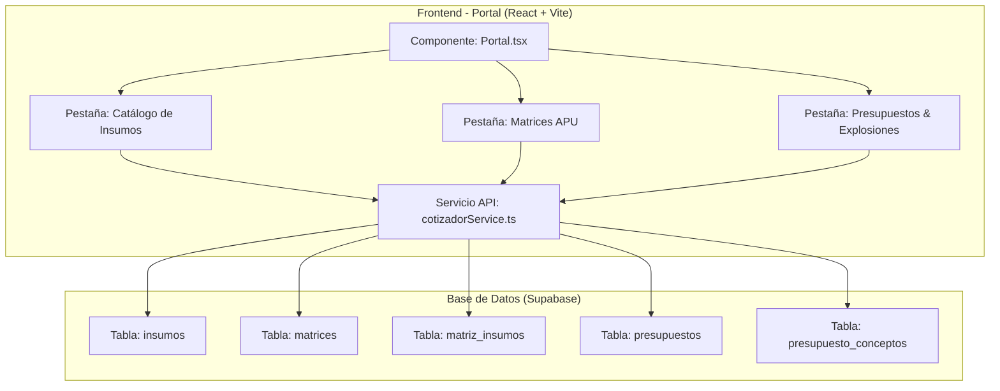

# Cotizador Esol Implementation Plan

> **For agentic workers:** REQUIRED SUB-SKILL: Use superpowers:subagent-driven-development to implement this plan task-by-task. Steps use checkbox (`- [ ]`) syntax for tracking.

**Goal:** Build a modular Construction-style Quote Calculator (APU / concept matrices like OPUS) for eSol Energías, allowing CRUD of insumos, matrix creation, budget calculation, and resource explosion.

**Architecture:** A React frontend (integrated in the Portal component) that communicates with local Supabase tables. Tab-based UI: Insumos (Catálogo Maestro), Matrices (APU Designer), Presupuestos (Budget & Reports).

**Architecture Diagram:**


**Tech Stack:** React 19, Tailwind CSS v4, Supabase JS Client, Lucide Icons, TypeScript.

---

### Task 1: SQL Database Setup

**Files:**
- Create: `supabase_cotizador_esol.sql`

- [ ] **Step 1: Write the SQL DDL commands**
  Create the SQL migration script to generate `insumos`, `matrices`, `matriz_insumos`, `presupuestos`, and `presupuesto_conceptos` tables along with their RLS policies and seed data.
  *Seed data should contain: 1 Cuadrilla, 4 Materials (Panel, Cable, Connector, Rack), and 1 sample Matrix.*

  Write to: `supabase_cotizador_esol.sql`
  ```sql
  -- Create tables, keys, RLS, and insert seed data
  ```

- [ ] **Step 2: Run verification script to test table structure**
  We will verify the file matches SQL rules. No direct command execution is required, but we must make sure the script runs cleanly on PostgreSQL.

- [ ] **Step 3: Commit migration file**
  Run:
  ```bash
  git add supabase_cotizador_esol.sql
  git commit -m "db: add tables and policies for cotizador esol"
  ```

---

### Task 2: Service Layer & TypeScript Types

**Files:**
- Create: `src/types/cotizador.ts`
- Create: `src/lib/cotizadorService.ts`
- Test: `tests/cotizadorService.test.ts`

- [ ] **Step 1: Create TypeScript Interfaces**
  Create types representing row shapes and calculations.
  Write to: `src/types/cotizador.ts`
  ```typescript
  export type InsumoType = 'material' | 'labor' | 'equipment' | 'tool';

  export interface Insumo {
    id: string;
    code: string;
    type: InsumoType;
    description: string;
    unit: string;
    cost: number;
    created_at?: string;
    updated_at?: string;
  }

  export interface Matriz {
    id: string;
    code: string;
    description: string;
    unit: string;
    indirect_percentage: number;
    utility_percentage: number;
    insumos?: { insumo: Insumo; quantity: number }[];
    created_at?: string;
  }

  export interface Presupuesto {
    id: string;
    name: string;
    client_name: string;
    status: 'borrador' | 'enviado' | 'aprobado' | 'rechazado';
    created_at?: string;
    updated_at?: string;
  }

  export interface PresupuestoConcepto {
    id: string;
    presupuesto_id: string;
    matriz_id: string;
    quantity: number;
    matriz?: Matriz;
  }
  ```

- [ ] **Step 2: Create Service Functions**
  Implement wrapper functions to run query fetches via supabase.
  Write to: `src/lib/cotizadorService.ts`
  ```typescript
  import { supabase } from '../context/supabase';
  import { Insumo, Matriz, Presupuesto, PresupuestoConcepto } from '../types/cotizador';

  export const cotizadorService = {
    // Insumos CRUD
    async getInsumos() {
      const { data, error } = await supabase.from('insumos').select('*').order('code');
      if (error) throw error;
      return data as Insumo[];
    },
    async saveInsumo(insumo: Omit<Insumo, 'id'> & { id?: string }) {
      if (insumo.id) {
        const { data, error } = await supabase.from('insumos').update(insumo).eq('id', insumo.id).select();
        if (error) throw error;
        return data[0];
      } else {
        const { data, error } = await supabase.from('insumos').insert(insumo).select();
        if (error) throw error;
        return data[0];
      }
    },
    async deleteInsumo(id: string) {
      const { error } = await supabase.from('insumos').delete().eq('id', id);
      if (error) throw error;
    },

    // Matrices CRUD
    async getMatrices() {
      const { data, error } = await supabase.from('matrices').select('*').order('code');
      if (error) throw error;
      return data as Matriz[];
    },
    async getMatrizDetails(id: string) {
      const { data: matriz, error: mError } = await supabase.from('matrices').select('*').eq('id', id).single();
      if (mError) throw mError;
      
      const { data: insumos, error: iError } = await supabase
        .from('matriz_insumos')
        .select('quantity, insumo:insumos(*)')
        .eq('matriz_id', id);
      if (iError) throw iError;

      return { ...matriz, insumos } as Matriz;
    },
    async saveMatriz(matriz: Omit<Matriz, 'id' | 'insumos'> & { id?: string }, insumosList: { insumo_id: string; quantity: number }[]) {
      let matrizId = matriz.id;
      if (matrizId) {
        const { error } = await supabase.from('matrices').update(matriz).eq('id', matrizId);
        if (error) throw error;
      } else {
        const { data, error } = await supabase.from('matrices').insert(matriz).select();
        if (error) throw error;
        matrizId = data[0].id;
      }

      // Re-populate junction records
      await supabase.from('matriz_insumos').delete().eq('matriz_id', matrizId);
      if (insumosList.length > 0) {
        const insertData = insumosList.map(item => ({
          matriz_id: matrizId,
          insumo_id: item.insumo_id,
          quantity: item.quantity
        }));
        const { error } = await supabase.from('matriz_insumos').insert(insertData);
        if (error) throw error;
      }

      return matrizId;
    },
    async deleteMatriz(id: string) {
      const { error } = await supabase.from('matrices').delete().eq('id', id);
      if (error) throw error;
    },

    // Presupuestos CRUD
    async getPresupuestos() {
      const { data, error } = await supabase.from('presupuestos').select('*').order('created_at', { ascending: false });
      if (error) throw error;
      return data as Presupuesto[];
    },
    async getPresupuestoDetails(id: string) {
      const { data: budget, error: bError } = await supabase.from('presupuestos').select('*').eq('id', id).single();
      if (bError) throw bError;

      const { data: concepts, error: cError } = await supabase
        .from('presupuesto_conceptos')
        .select('id, quantity, matriz:matrices(*)')
        .eq('presupuesto_id', id);
      if (cError) throw cError;

      // Hydrate concepts with matrix details
      const conceptsWithDetails = await Promise.all((concepts || []).map(async (concept: any) => {
        if (!concept.matriz?.id) return concept;
        const details = await this.getMatrizDetails(concept.matriz.id);
        return { ...concept, matriz: details };
      }));

      return { budget, concepts: conceptsWithDetails };
    },
    async savePresupuesto(budget: Omit<Presupuesto, 'id'> & { id?: string }, concepts: { matriz_id: string; quantity: number }[]) {
      let budgetId = budget.id;
      if (budgetId) {
        const { error } = await supabase.from('presupuestos').update(budget).eq('id', budgetId);
        if (error) throw error;
      } else {
        const { data, error } = await supabase.from('presupuestos').insert(budget).select();
        if (error) throw error;
        budgetId = data[0].id;
      }

      // Re-populate concepts
      await supabase.from('presupuesto_conceptos').delete().eq('presupuesto_id', budgetId);
      if (concepts.length > 0) {
        const insertData = concepts.map(item => ({
          presupuesto_id: budgetId,
          matriz_id: item.matriz_id,
          quantity: item.quantity
        }));
        const { error } = await supabase.from('presupuesto_conceptos').insert(insertData);
        if (error) throw error;
      }

      return budgetId;
    }
  };
  ```

- [ ] **Step 3: Create Math Sizing calculation tests**
  Write a test file to verify calculations for direct cost and unit price.
  Write to: `tests/cotizadorService.test.ts`
  ```typescript
  import { Insumo, Matriz } from '../src/types/cotizador';

  // Test Direct Cost math formula
  const insumos: { insumo: Insumo; quantity: number }[] = [
    { insumo: { id: '1', code: 'MAT-1', type: 'material', description: 'Panel', unit: 'pza', cost: 100 }, quantity: 1 },
    { insumo: { id: '2', code: 'MO-1', type: 'labor', description: 'Cuadrilla', unit: 'jor', cost: 1000 }, quantity: 0.125 } // Rendimiento 8/día
  ];

  const indirect_percentage = 10; // 10%
  const utility_percentage = 8; // 8%

  // CD calculation
  const cd = insumos.reduce((sum, item) => sum + (item.insumo.cost * item.quantity), 0);
  console.assert(cd === 225, `CD should be 225, got ${cd}`);

  // PU calculation
  const pu = cd * (1 + indirect_percentage / 100) * (1 + utility_percentage / 100);
  const expectedPu = 225 * 1.10 * 1.08; // 267.3
  console.assert(Math.abs(pu - expectedPu) < 0.001, `PU should be ${expectedPu}, got ${pu}`);
  console.log("Calculations verification: PASSED!");
  ```

- [ ] **Step 4: Execute calculations verification**
  Run:
  ```bash
  npx tsx tests/cotizadorService.test.ts
  ```
  Expected output: `Calculations verification: PASSED!`

- [ ] **Step 5: Commit types & services**
  Run:
  ```bash
  git add src/types/cotizador.ts src/lib/cotizadorService.ts tests/cotizadorService.test.ts
  git commit -m "feat: add TS types and Supabase service layer for cotizador"
  ```

---

### Task 3: Catálogo de Insumos UI Component

**Files:**
- Create: `src/components/cotizador/InsumosTab.tsx`
- Modify: `src/components/Portal.tsx`

- [ ] **Step 1: Create InsumosTab component**
  Build table layout with tab sub-filters (`material`, `labor`, `equipment`), search bar, and add/edit forms.
  Write to: `src/components/cotizador/InsumosTab.tsx`

- [ ] **Step 2: Connect InsumosTab to Portal.tsx**
  Integrate `InsumosTab` inside the tab container of `Portal.tsx` when subTab is "insumos".

- [ ] **Step 3: Run build to verify type checking**
  Run:
  ```bash
  npm run build
  ```
  Expected output: Build success.

- [ ] **Step 4: Commit UI changes**
  Run:
  ```bash
  git add src/components/cotizador/InsumosTab.tsx
  git commit -m "feat: add InsumosTab catalog UI and integrate into Portal"
  ```

---

### Task 4: Matrices (APU) Editor UI

**Files:**
- Create: `src/components/cotizador/MatricesTab.tsx`

- [ ] **Step 1: Create MatricesTab component**
  Build a two-column split layout. Left panel has concept cards. Right panel is the detail editor where masters add insumos, adjust quantities/rendimientos, and tune `% Indirectos` / `% Utilidad` sliders.
  Write to: `src/components/cotizador/MatricesTab.tsx`

- [ ] **Step 2: Connect MatricesTab to Portal.tsx**
  Render `MatricesTab` in `Portal.tsx` when subTab is "matrices".

- [ ] **Step 3: Run build to verify correct imports**
  Run:
  ```bash
  npm run build
  ```
  Expected output: Build success.

- [ ] **Step 4: Commit MatricesTab**
  Run:
  ```bash
  git add src/components/cotizador/MatricesTab.tsx
  git commit -m "feat: add MatricesTab APU designer UI and integrate into Portal"
  ```

---

### Task 5: Presupuestos & Explosiones UI

**Files:**
- Create: `src/components/cotizador/PresupuestosTab.tsx`
- Modify: `src/components/Portal.tsx`

- [ ] **Step 1: Create PresupuestosTab component**
  Provide budget list view, budget editor (concepts table), and lower tabs for:
  - **Conceptos:** Budget details.
  - **Explosión de Insumos:** Consolidates all materials and labor counts.
  - **Explosión de Mano de Obra:** Lists total required work hours/jornadas.
  - **Exportar:** Simulates clean report printable layout.
  Write to: `src/components/cotizador/PresupuestosTab.tsx`

- [ ] **Step 2: Integrate into Portal.tsx**
  Hook everything together inside `activeTab === 'cotizador'` block in `Portal.tsx`. Replace the current placeholder div with a sub-navigation bar (Presupuestos, Matrices, Insumos) and toggle state.
  Modify: `src/components/Portal.tsx`

- [ ] **Step 3: Run build validation**
  Run:
  ```bash
  npm run build
  ```
  Expected output: Build success.

- [ ] **Step 4: Commit budgets and main integration**
  Run:
  ```bash
  git add src/components/cotizador/PresupuestosTab.tsx src/components/Portal.tsx
  git commit -m "feat: integrate cotizador tabs and budgets list under Portal.tsx"
  ```
