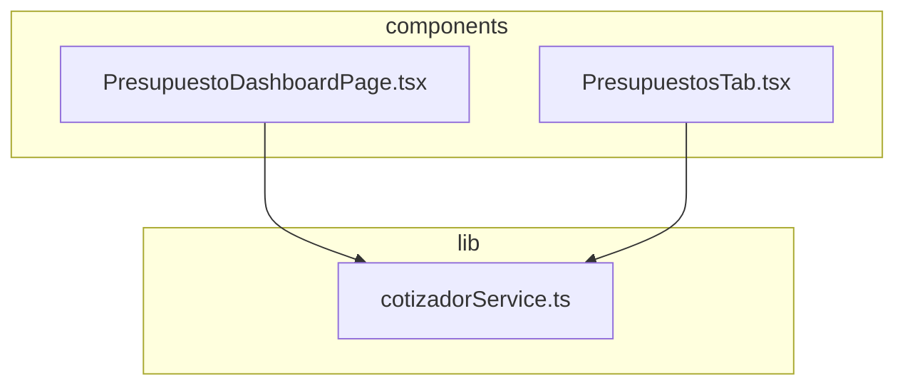

# Round "pza" Quantities Implementation Plan

> **For agentic workers:** REQUIRED SUB-SKILL: Use superpowers:subagent-driven-development to implement this plan task-by-task. Steps use checkbox (`- [ ]`) syntax for tracking.

**Goal:** Round all concepts and insumos (supplies) with unit 'pza' to integer numbers in calculations, database writes, and UI display.

**Architecture:** Perform rounding during calculations in `calculateMatrixDirectCost` and report aggregations, enforce integer inputs for 'pza' fields in editor inputs, and sync roundings to the database. Use a shared formatting helper in the UI.

**Architecture Diagram:**


**Tech Stack:** React 19, TypeScript, Supabase, tsx for testing.

---

### Task 1: Core Calculations & Database Sync

**Files:**
- Modify: `src/lib/cotizadorService.ts:485-500`
- Modify: `src/lib/cotizadorService.ts:255-265`
- Modify: `tests/cotizadorService.test.ts:90-120`

- [ ] **Step 1: Write the failing test**
  Add a new test inside `tests/cotizadorService.test.ts` to assert rounding behavior for `"pza"` unit insumos.
  ```typescript
  // Test 5: Rounding for "pza" units
  console.log('\nRunning Test 5: Rounding for pza units...');
  const mockInsumosPza = [
    {
      insumo: { id: 'pza-1', code: 'INS-P1', type: 'material', description: 'Insumo Pza 1', unit: 'pza', cost: 100 } as Insumo,
      quantity: 1.4
    }
  ];
  const costPzaQ1 = calculateMatrixDirectCost(mockInsumosPza, 1);
  assertEquals(costPzaQ1, 100, 'Pza unit cost at Q=1 should round 1.4 to 1');

  const costPzaQ5 = calculateMatrixDirectCost(mockInsumosPza, 5);
  assertEquals(costPzaQ5, 140, 'Pza unit cost at Q=5 should scale and round (1.4*5=7) -> 140');
  ```

- [ ] **Step 2: Run test to verify it fails**
  Run: `npx tsx tests/cotizadorService.test.ts`
  Expected: FAIL with assertion error for Test 5

- [ ] **Step 3: Write minimal implementation**
  Modify `calculateMatrixDirectCost` and `saveMatriz` in `src/lib/cotizadorService.ts`:
  ```typescript
  export function calculateMatrixDirectCost(
    insumos: { insumo: { cost: number; unit?: string }; quantity: number; formula?: string | null }[],
    conceptQty: number = 1
  ): number {
    return insumos.reduce((sum, item) => {
      const qty = item.formula 
        ? evaluateFormula(item.formula, conceptQty) 
        : Number(item.quantity);
      const isPza = item.insumo?.unit?.trim().toLowerCase() === 'pza';
      const adjustedQty = isPza && conceptQty > 0
        ? Math.round(qty * conceptQty) / conceptQty
        : qty;
      return sum + (Number(item.insumo?.cost || 0) * adjustedQty);
    }, 0);
  }
  ```
  And in `saveMatriz`:
  ```typescript
      const insumosToUpsert = matriz.insumos.map((item) => {
        const isPza = item.insumo?.unit?.trim().toLowerCase() === 'pza';
        const qty = isPza && !item.formula ? Math.round(Number(item.quantity)) : Number(item.quantity);
        return {
          matriz_id: savedMatrix.id,
          insumo_id: item.insumo.id,
          quantity: qty,
          formula: item.formula || null
        };
      });
  ```

- [ ] **Step 4: Run test to verify it passes**
  Run: `npx tsx tests/cotizadorService.test.ts`
  Expected: PASS

- [ ] **Step 5: Commit**
  Run:
  ```bash
  git add src/lib/cotizadorService.ts tests/cotizadorService.test.ts
  git commit -m "feat: implement rounding for pza unit insumos in core calculations and db sync"
  ```

---

### Task 2: Budget Dashboard UI & Aggregates

**Files:**
- Modify: `src/components/cotizador/PresupuestoDashboardPage.tsx`

- [ ] **Step 1: Ensure formatQty is defined and used**
  Define `formatQty` inside `PresupuestoDashboardPage.tsx`:
  ```typescript
  const formatQty = (qty: number, unit?: string, decimals = 4): string => {
    const isPza = unit?.trim().toLowerCase() === 'pza';
    if (isPza) return Math.round(qty).toString();
    return parseFloat(qty.toFixed(decimals)).toString();
  };
  ```
  Ensure it is used for rendering insumo quantity column and formula result text.

- [ ] **Step 2: Add concept quantity rounding in Dashboard**
  Update `handleAddConceptFromMatrix` and `handleAddCustomConcept` to round quantity if the unit is `"pza"`.
  Update `NumericInput` for concepts to use:
  ```typescript
  step={c.unit?.trim().toLowerCase() === 'pza' ? "1" : "0.01"}
  min="0"
  value={Number(c.quantity)}
  onChange={async (val) => {
    const isPza = c.unit?.trim().toLowerCase() === 'pza';
    const finalVal = isPza ? Math.round(val) : val;
    await handleUpdateConceptQuantity(c.id, finalVal);
  }}
  ```

- [ ] **Step 3: Round pza in aggregatedInsumos**
  Modify lines 1085-1090 inside `PresupuestoDashboardPage.tsx`:
  ```typescript
        const isPza = item.insumo.unit?.trim().toLowerCase() === 'pza';
        const finalQty = isPza ? Math.round(matrixQty * qty) : (matrixQty * qty);
        const totalCost = costVal * finalQty;
  ```

- [ ] **Step 4: Round pza in the Matrix Editor modal list**
  Update matrix editor rendering inside `PresupuestoDashboardPage.tsx`:
  ```typescript
                           const isPza = item.insumo.unit?.trim().toLowerCase() === 'pza';
                           const qty = item.formula 
                             ? evaluateFormula(item.formula, activeConceptQty) 
                             : Number(item.quantity) || 0;
                           const finalQty = isPza ? Math.round(qty * activeConceptQty) / activeConceptQty : qty;
                           const importe = item.insumo.cost * finalQty;
  ```
  And round in `onChange` for manual numeric inputs:
  ```typescript
                                        if (isNumeric) {
                                          let finalVal = Number(trimmed);
                                          const isPza = it.insumo.unit?.trim().toLowerCase() === 'pza';
                                          if (isPza) finalVal = Math.round(finalVal);
                                          return { ...it, quantity: finalVal, formula: null };
                                        }
  ```

- [ ] **Step 5: Commit**
  Run:
  ```bash
  git add src/components/cotizador/PresupuestoDashboardPage.tsx
  git commit -m "feat: support pza unit rounding in budget dashboard UI, inputs, and aggregates"
  ```

---

### Task 3: Budget Tab UI & Reports

**Files:**
- Modify: `src/components/cotizador/PresupuestosTab.tsx`

- [ ] **Step 1: Ensure formatQty is defined and used**
  Define `formatQty` in `PresupuestosTab.tsx`:
  ```typescript
  const formatQty = (qty: number, unit?: string, decimals = 4): string => {
    const isPza = unit?.trim().toLowerCase() === 'pza';
    if (isPza) return Math.round(qty).toString();
    return parseFloat(qty.toFixed(decimals)).toString();
  };
  ```
  Ensure it is used to format the concept's quantity and the aggregated insumo's quantity in markdown/PDF copy.

- [ ] **Step 2: Add concept quantity rounding in PresupuestosTab**
  Update `handleUpdateConceptField`:
  ```typescript
  const handleUpdateConceptField = (conceptId: string, field: 'quantity' | 'cost_price' | 'indirect_percentage' | 'utility_percentage', value: number) => {
    setFormConceptos(prev => prev.map(c => {
      if (c.id === conceptId) {
        let finalVal = value;
        if (field === 'quantity') {
          const isPza = c.unit?.trim().toLowerCase() === 'pza';
          if (isPza) finalVal = Math.round(value);
        }
        return { ...c, [field]: finalVal };
      }
      return c;
    }));
  };
  ```
  And check and round starting quantity in `handleAddConcept`, `handleAddCustomConcept`, `handleAddMatrixAsConcept` when unit is `"pza"`.

- [ ] **Step 3: Round pza in insumos explosion**
  In `getAggregatedInsumos` inside `PresupuestosTab.tsx`:
  ```typescript
        const isPza = insumo.unit?.trim().toLowerCase() === 'pza';
        const neededQty = isPza ? Math.round(conceptQty * quantityPerUnit) : (conceptQty * quantityPerUnit);
  ```

- [ ] **Step 4: Commit**
  Run:
  ```bash
  git add src/components/cotizador/PresupuestosTab.tsx
  git commit -m "feat: support pza unit rounding in budget tab UI, inputs, and reports"
  ```
