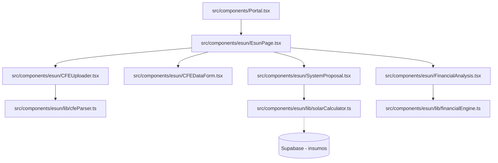

# Esun Solar Quoter Implementation Plan

> **For agentic workers:** REQUIRED SUB-SKILL: Use superpowers:subagent-driven-development to implement this plan task-by-task. Steps use checkbox (`- [ ]`) syntax for tracking.

**Goal:** Build an independent solar PV system sizing, quoting, and financial projection tool ("Esun") inside the eSol portal that parses CFE electricity bills, calculates solar panel, string, and inverter requirements, generates 25-year financial projections, and exports a premium PDF.

**Architecture:** The module is built fully isolated in `src/components/esun/` using utility files for calculations and React components for the UI. It integrates with the existing Supabase instance only to read available panels and inverters from the `insumos` table.



**Tech Stack:** React 19, Tailwind CSS, Lucide React, pdfjs-dist (for PDF text parsing), Recharts (for charts), html2pdf.js (for PDF report download).

---

### Task 1: Setup Dependencies & Constants

**Files:**
- Modify: `package.json`
- Create: `src/components/esun/lib/solarConstants.ts`

- [ ] **Step 1: Install pdfjs-dist and recharts**
  Add `pdfjs-dist` (v3.11.174 or latest stable) and `recharts` (v2.12.0 or compatible) to `package.json` dependencies.
  
  ```diff
     "dependencies": {
       "@supabase/supabase-js": "^2.108.1",
       "@tailwindcss/vite": "^4.3.0",
       "html2pdf.js": "^0.14.0",
       "lucide-react": "^1.17.0",
       "motion": "^12.40.0",
       "react": "^19.2.6",
       "react-dom": "^19.2.6",
  +    "pdfjs-dist": "^3.11.174",
  +    "recharts": "^2.12.0",
       "tailwindcss": "^4.3.0"
     },
  ```

- [ ] **Step 2: Run npm install**
  Run: `npm install`
  Expected: Installation finishes successfully.

- [ ] **Step 3: Define solar constants**
  Create `src/components/esun/lib/solarConstants.ts` with all the calculation defaults and PSH values:
  
  ```typescript
  export const SOLAR_CONSTANTS = {
    CO2_FACTOR: 0.444,         // kg CO2/kWh (SEMARNAT 2024)
    PR_DEFAULT: 0.77,          // Performance Ratio average Mexico
    TARIFF_ESCALATION: 0.06,   // 6% annual CFE inflation
    PANEL_DEGRADATION: 0.005,  // 0.5% annual degradation (TOPCon)
    DISCOUNT_RATE: 0.10,       // 10% for NPV discount factor
    SYSTEM_LIFE: 25,
    DC_AC_RATIO: 1.10,         // Target DC capacity / Inverter AC capacity
    CO2_PER_TREE_KG: 21.77,    // Annual CO2 absorbed by one mature tree
    CO2_PER_CAR_TONS: 4.6,     // Annual CO2 emissions of average passenger car
    CO2_PER_COAL_TON: 2.42,    // CO2 produced by burning 1 ton of coal
    AREA_PER_PANEL_M2: 2.1,    // Average 550W panel area
    AREA_SPACING: 1.15,        // Spacing factor (15% additional)
    SIZING_MARGIN: 1.20,       // 20% sizing safety margin for production offset
    PSH: {
      'Hermosillo': 6.3,
      'Mexicali': 6.0,
      'Tijuana': 5.8,
      'Chihuahua': 5.9,
      'Ciudad Juárez': 5.9,
      'Monterrey': 5.5,
      'Guadalajara': 5.5,
      'CDMX': 5.0,
      'Ciudad de México': 5.0,
      'Cancún': 5.3,
      'Mérida': 5.5,
      'Puebla': 5.3,
      'Oaxaca': 4.9,
      'Veracruz': 4.8,
      'Tampico': 5.1,
      'default': 5.0,
    } as Record<string, number>,
    COST_PER_W_MXN: {
      small: 17,      // <= 5 kWp
      medium: 15,     // 5-10 kWp
      commercial: 14, // 10-50 kWp
      industrial: 12, // >50 kWp
    }
  };
  ```

- [ ] **Step 4: Commit**
  Run:
  ```bash
  git add package.json src/components/esun/lib/solarConstants.ts
  git commit -m "chore: setup dependencies and solar constants for Esun"
  ```

---

### Task 2: Math, Sizing and Electrical Engine

**Files:**
- Create: `src/components/esun/lib/solarCalculator.ts`
- Create: `tests/esunService.test.ts`

- [ ] **Step 1: Implement Sizing Calculations**
  Create `src/components/esun/lib/solarCalculator.ts` with logic for calculating kWp, panels, string configurations, area, and estimated production.
  
  ```typescript
  import { SOLAR_CONSTANTS } from './solarConstants';

  export interface SizingInput {
    monthly_kWh: number;
    city: string;
    panel_Wp: number;
    panel_Voc: number;
    inverter_max_vdc: number;
    inverter_kw: number;
  }

  export interface SizingResult {
    system_kWp: number;
    num_panels: number;
    panels_per_string: number;
    num_strings: number;
    string_Voc: number;
    is_electrical_safe: boolean;
    area_m2: number;
    annual_production_kWh: number;
    monthly_production_kWh: number;
  }

  export function calculateSizing(input: SizingInput): SizingResult {
    const psh = SOLAR_CONSTANTS.PSH[input.city] || SOLAR_CONSTANTS.PSH['default'];
    const pr = SOLAR_CONSTANTS.PR_DEFAULT;

    // 1. Target kWp sizing with 20% margin
    const system_kWp = (input.monthly_kWh * SOLAR_CONSTANTS.SIZING_MARGIN) / (psh * 30 * pr);
    
    // 2. Number of panels
    const num_panels = Math.ceil((system_kWp * 1000) / input.panel_Wp);

    // 3. Electrical strings check
    // Max panels per string based on Voc limit (with 5% cold temperature safe margin)
    const panels_per_string = Math.floor(input.inverter_max_vdc / (input.panel_Voc * 1.05));
    
    const num_strings = panels_per_string > 0 ? Math.ceil(num_panels / panels_per_string) : 0;
    const string_Voc = panels_per_string * input.panel_Voc * 1.05;
    const is_electrical_safe = panels_per_string > 0 && string_Voc < input.inverter_max_vdc;

    // 4. Area
    const area_m2 = num_panels * SOLAR_CONSTANTS.AREA_PER_PANEL_M2 * SOLAR_CONSTANTS.AREA_SPACING;

    // 5. Production
    const annual_production_kWh = system_kWp * psh * 365 * pr;
    const monthly_production_kWh = annual_production_kWh / 12;

    return {
      system_kWp,
      num_panels,
      panels_per_string,
      num_strings,
      string_Voc,
      is_electrical_safe,
      area_m2,
      annual_production_kWh,
      monthly_production_kWh
    };
  }
  ```

- [ ] **Step 2: Create automated tests**
  Create `tests/esunService.test.ts` to assert correct sizing calculations.
  
  ```typescript
  import { calculateSizing } from '../src/components/esun/lib/solarCalculator';

  function assertEquals(actual: any, expected: any, message: string) {
    if (JSON.stringify(actual) !== JSON.stringify(expected)) {
      throw new Error(`FAIL: ${message}. Expected ${expected}, got ${actual}`);
    }
    console.log(`✓ PASS: ${message}`);
  }

  function runTests() {
    console.log('Running Esun Sizing Engine tests...');

    // Monterrey (PSH = 5.5), 1200 kWh/bimonthly = 600 kWh/month. Panel = 550W, Voc = 50V. Inverter Max Vdc = 600V.
    const result = calculateSizing({
      monthly_kWh: 600,
      city: 'Monterrey',
      panel_Wp: 550,
      panel_Voc: 50,
      inverter_max_vdc: 600,
      inverter_kw: 5
    });

    // 1. kWp = (600 * 1.20) / (5.5 * 30 * 0.77) = 720 / 127.05 = 5.667 kWp
    assertEquals(Math.round(result.system_kWp * 100) / 100, 5.67, 'system_kWp calculation');

    // 2. Panels = ceil(5.667 * 1000 / 550) = ceil(10.3) = 11 panels
    assertEquals(result.num_panels, 11, 'num_panels calculation');

    // 3. Max panels per string = floor(600 / (50 * 1.05)) = floor(600 / 52.5) = floor(11.4) = 11
    assertEquals(result.panels_per_string, 11, 'panels_per_string calculation');
    assertEquals(result.num_strings, 1, 'num_strings calculation');
    assertEquals(result.is_electrical_safe, true, 'electrical safety check');

    console.log('All Esun Sizing Engine tests passed.');
  }

  try {
    runTests();
    process.exit(0);
  } catch (err) {
    console.error(err);
    process.exit(1);
  }
  ```

- [ ] **Step 3: Run sizing tests**
  Run: `npx tsx tests/esunService.test.ts`
  Expected: Tests pass successfully.

- [ ] **Step 4: Commit**
  Run:
  ```bash
  git add src/components/esun/lib/solarCalculator.ts tests/esunService.test.ts
  git commit -m "feat: implement sizing and electrical calculator with unit tests"
  ```

---

### Task 3: Financial & Environmental Projection Engine

**Files:**
- Create: `src/components/esun/lib/financialEngine.ts`
- Modify: `tests/esunService.test.ts`

- [ ] **Step 1: Implement Financial Projection Logic**
  Create `src/components/esun/lib/financialEngine.ts` to compute payback, ROI, NPV, 25-year cashflows, and carbon equivalents.
  
  ```typescript
  import { SOLAR_CONSTANTS } from './solarConstants';

  export interface FinancialInput {
    system_kWp: number;
    annual_production_kWh: number;
    monthly_consumption_kWh: number;
    tariff_rate_mxn: number; // Cost per kWh
    custom_cost?: number;    // Manual system price override
  }

  export interface FinancialResult {
    investment_mxn: number;
    annual_savings_yr1: number;
    payback_years: number;
    npv: number;
    roi_pct: number;
    cashflows_25yr: number[];
    co2_saved_kg_25yr: number;
    trees_equivalent: number;
    cars_equivalent: number;
    coal_equivalent_tons: number;
  }

  export function calculateFinancials(input: FinancialInput): FinancialResult {
    // 1. Calculate investment cost based on system size if not custom overridden
    let costPerWatt = SOLAR_CONSTANTS.COST_PER_W_MXN.small;
    const size = input.system_kWp;
    if (size > 50) {
      costPerWatt = SOLAR_CONSTANTS.COST_PER_W_MXN.industrial;
    } else if (size > 10) {
      costPerWatt = SOLAR_CONSTANTS.COST_PER_W_MXN.commercial;
    } else if (size > 5) {
      costPerWatt = SOLAR_CONSTANTS.COST_PER_W_MXN.medium;
    }
    const investment_mxn = input.custom_cost ?? (size * 1000 * costPerWatt);

    // 2. Year 1 savings
    const annual_consumption = input.monthly_consumption_kWh * 12;
    const annual_savings_yr1 = Math.min(input.annual_production_kWh, annual_consumption) * input.tariff_rate_mxn;

    // 3. Cashflows over 25 years with escalation and degradation
    const cashflows_25yr: number[] = [];
    let cumulative_savings = 0;
    for (let yr = 1; yr <= SOLAR_CONSTANTS.SYSTEM_LIFE; yr++) {
      const savings = annual_savings_yr1
        * Math.pow(1 + SOLAR_CONSTANTS.TARIFF_ESCALATION, yr - 1)
        * Math.pow(1 - SOLAR_CONSTANTS.PANEL_DEGRADATION, yr - 1);
      cashflows_25yr.push(savings);
      cumulative_savings += savings;
    }

    // 4. Payback years (simple)
    const payback_years = annual_savings_yr1 > 0 ? investment_mxn / annual_savings_yr1 : 99;

    // 5. NPV
    let npv = -investment_mxn;
    cashflows_25yr.forEach((cf, t) => {
      npv += cf / Math.pow(1 + SOLAR_CONSTANTS.DISCOUNT_RATE, t + 1);
    });

    // 6. ROI percentage
    const roi_pct = investment_mxn > 0 ? ((cumulative_savings - investment_mxn) / investment_mxn) * 100 : 0;

    // 7. Environmental Metrics
    const total_production_25yr = input.annual_production_kWh * SOLAR_CONSTANTS.SYSTEM_LIFE;
    const co2_saved_kg_25yr = total_production_25yr * SOLAR_CONSTANTS.CO2_FACTOR;
    const trees_equivalent = co2_saved_kg_25yr / SOLAR_CONSTANTS.CO2_PER_TREE_KG;
    const cars_equivalent = (co2_saved_kg_25yr / 1000) / SOLAR_CONSTANTS.CO2_PER_CAR_TONS;
    const coal_equivalent_tons = (co2_saved_kg_25yr / 1000) / SOLAR_CONSTANTS.CO2_PER_COAL_TON;

    return {
      investment_mxn,
      annual_savings_yr1,
      payback_years,
      npv,
      roi_pct,
      cashflows_25yr,
      co2_saved_kg_25yr,
      trees_equivalent,
      cars_equivalent,
      coal_equivalent_tons
    };
  }
  ```

- [ ] **Step 2: Update tests with financial assertions**
  Modify `tests/esunService.test.ts` to add financial and environmental tests.
  
  ```typescript
  // Append to runTests() inside tests/esunService.test.ts:
  
  import { calculateFinancials } from '../src/components/esun/lib/financialEngine';

  console.log('\nRunning Esun Financial Engine tests...');
  const finResult = calculateFinancials({
    system_kWp: 5,
    annual_production_kWh: 7700,
    monthly_consumption_kWh: 600, // 7200 kWh/year
    tariff_rate_mxn: 4.50 // DAC
  });

  // Investment should be 5 kWp * 1000 * 17 MXN/W = 85000 MXN
  assertEquals(finResult.investment_mxn, 85000, 'investment calculation');
  
  // Year 1 savings = min(7700, 7200) * 4.50 = 7200 * 4.50 = 32400 MXN
  assertEquals(finResult.annual_savings_yr1, 32400, 'annual savings year 1');

  // Payback = 85000 / 32400 = 2.62 years
  assertEquals(Math.round(finResult.payback_years * 100) / 100, 2.62, 'simple payback years');

  // CO2 saved 25yr = 7700 * 25 * 0.444 = 85470 kg
  assertEquals(finResult.co2_saved_kg_25yr, 85470, 'CO2 savings over 25 years');
  ```

- [ ] **Step 3: Run updated tests**
  Run: `npx tsx tests/esunService.test.ts`
  Expected: Sizing and financial tests pass.

- [ ] **Step 4: Commit**
  Run:
  ```bash
  git add src/components/esun/lib/financialEngine.ts tests/esunService.test.ts
  git commit -m "feat: implement financial projection engine with 25-year cashflows"
  ```

---

### Task 4: CFE Bill PDF Parser

**Files:**
- Create: `src/components/esun/lib/cfeParser.ts`

- [ ] **Step 1: Implement text-extraction and regex parsing**
  Create `src/components/esun/lib/cfeParser.ts` utilizing `pdfjs-dist` to parse PDFs and match fields with regex.
  
  ```typescript
  import * as pdfjsLib from 'pdfjs-dist';

  // Configure worker
  pdfjsLib.GlobalWorkerOptions.workerSrc = `//cdnjs.cloudflare.com/ajax/libs/pdf.js/3.11.174/pdf.worker.min.js`;

  export interface CFEData {
    service_number?: string;
    client_name?: string;
    tariff: string;
    monthly_kWh: number;
    bimonthly_kWh: number;
    total_mxn: number;
    tariff_rate: number;
    demand_kw?: number;
    power_factor?: number;
    period_start?: string;
    period_end?: string;
    is_bimonthly: boolean;
  }

  export async function parseCFEPdf(file: File): Promise<CFEData> {
    const arrayBuffer = await file.arrayBuffer();
    const pdf = await pdfjsLib.getDocument({ data: arrayBuffer }).promise;
    let fullText = '';
    
    for (let i = 1; i <= pdf.numPages; i++) {
      const page = await pdf.getPage(i);
      const textContent = await page.getTextContent();
      const pageText = textContent.items.map((item: any) => item.str).join(' ');
      fullText += pageText + '\n';
    }

    // Apply regex parsing
    const tariffMatch = fullText.match(/Tarifa[\s:]+([A-Z0-9]+)/i);
    const serviceMatch = fullText.match(/Núm(?:ero)?[\s.]+Servicio[\s:]+(\d{12})/i);
    const totalMatch = fullText.match(/Total a [Pp]agar[\s:]+\$?([\d,]+\.?\d*)/i);
    const demandMatch = fullText.match(/Demanda[\s:]+(\d+\.?\d*)\s*kW/i);
    const pfMatch = fullText.match(/Factor de Potencia[\s:]+(\d+\.?\d*)/i);

    // Try extracting bimonthly/monthly consumption kWh
    const consumptionMatch = fullText.match(/Consumo[\s:]+(\d+)\s*kWh/i);

    // Parse values
    const tariff = tariffMatch ? tariffMatch[1].toUpperCase() : 'DAC';
    const total_mxn = totalMatch ? parseFloat(totalMatch[1].replace(/,/g, '')) : 0;
    const bimonthly_kWh = consumptionMatch ? parseInt(consumptionMatch[1]) : 1200; // default safe fallback
    
    // Auto-detect bimonthly vs monthly (CFE residential bimonthly, commercial monthly)
    const is_bimonthly = !tariff.startsWith('G') && !tariff.startsWith('P'); // GDMTH, PDBT monthly
    const monthly_kWh = is_bimonthly ? Math.round(bimonthly_kWh / 2) : bimonthly_kWh;

    const tariff_rate = monthly_kWh > 0 ? (total_mxn / (is_bimonthly ? bimonthly_kWh : monthly_kWh)) : 4.50;

    return {
      service_number: serviceMatch ? serviceMatch[1] : undefined,
      tariff,
      monthly_kWh,
      bimonthly_kWh,
      total_mxn,
      tariff_rate: parseFloat(tariff_rate.toFixed(2)),
      demand_kw: demandMatch ? parseFloat(demandMatch[1]) : undefined,
      power_factor: pfMatch ? parseFloat(pfMatch[1]) : undefined,
      is_bimonthly
    };
  }
  ```

- [ ] **Step 2: Commit**
  Run:
  ```bash
  git add src/components/esun/lib/cfeParser.ts
  git commit -m "feat: implement pdf parser for CFE bills using pdfjs-dist"
  ```

---

### Task 5: UI Pages & Components

**Files:**
- Create: `src/components/esun/EsunPage.tsx`
- Create: `src/components/esun/CFEUploader.tsx`
- Create: `src/components/esun/CFEDataForm.tsx`
- Create: `src/components/esun/SystemProposal.tsx`
- Create: `src/components/esun/FinancialAnalysis.tsx`
- Create: `src/components/esun/EnvironmentalImpact.tsx`

- [ ] **Step 1: Implement EsunPage main dashboard container**
  Create `src/components/esun/EsunPage.tsx` handling views: upload → data edit → results & graphs → export. Supports localStorage persistency.
  
  ```typescript
  import React, { useState, useEffect } from 'react';
  import CFEUploader from './CFEUploader';
  import CFEDataForm from './CFEDataForm';
  import SystemProposal from './SystemProposal';
  import FinancialAnalysis from './FinancialAnalysis';
  import EnvironmentalImpact from './EnvironmentalImpact';
  import { cfeParser } from './lib/cfeParser';

  export default function EsunPage() {
    const [view, setView] = useState<'upload' | 'form' | 'results'>('upload');
    const [cfeData, setCfeData] = useState<any>(null);
    const [system, setSystem] = useState<any>(null);
    
    // Add default initial hooks for quotes management
    return (
      <div className="p-6 bg-dark-1 text-cream min-h-screen">
        <h1 className="text-3xl font-bold font-display text-gold mb-6">ESUN — Cotizador Solar</h1>
        {view === 'upload' && <CFEUploader onParsed={(data) => { setCfeData(data); setView('form'); }} />}
        {view === 'form' && <CFEDataForm data={cfeData} onSubmit={(finalData) => { setCfeData(finalData); setView('results'); }} />}
        {view === 'results' && (
          <div className="grid grid-cols-1 lg:grid-cols-2 gap-6">
            <SystemProposal cfeData={cfeData} onUpdate={setSystem} />
            {system && (
              <>
                <FinancialAnalysis system={system} cfeData={cfeData} />
                <EnvironmentalImpact system={system} />
              </>
            )}
          </div>
        )}
      </div>
    );
  }
  ```

- [ ] **Step 2: Create CFEUploader drag and drop interface**
  Create `src/components/esun/CFEUploader.tsx` with a modern dashed gold frame and parse status handler.

- [ ] **Step 3: Create CFEDataForm confirmation**
  Create `src/components/esun/CFEDataForm.tsx` to double-check and manual-input tariff, consumption, and CFE rate.

- [ ] **Step 4: Create SystemProposal dimensioning display**
  Create `src/components/esun/SystemProposal.tsx`. Reads panel/inverter details, displays strings configuration, and includes number-inputs for override.

- [ ] **Step 5: Create FinancialAnalysis with Recharts**
  Create `src/components/esun/FinancialAnalysis.tsx` showing cashflow bars and direct cost distribution pie chart.

- [ ] **Step 6: Create EnvironmentalImpact metrics**
  Create `src/components/esun/EnvironmentalImpact.tsx` with standard icons (Leaf, Trees, Cars, Zap) and 25-year saved numbers.

- [ ] **Step 7: Commit**
  Run:
  ```bash
  git add src/components/esun/
  git commit -m "feat: complete Esun UI modules and React components"
  ```

---

### Task 6: PDF Report & Portal Integration

**Files:**
- Create: `src/components/esun/ExportPDF.tsx`
- Modify: `src/components/Portal.tsx`

- [ ] **Step 1: Create PDF template exporter**
  Create `src/components/esun/ExportPDF.tsx` using `html2pdf.js` to render the clean corporate white background layout.
  
  ```typescript
  import html2pdf from 'html2pdf.js';

  export function exportEsunPDF(quote: any) {
    const element = document.createElement('div');
    element.innerHTML = `
      <div style="padding: 40px; font-family: 'Josefin Sans', sans-serif; color: #1e293b;">
        <h1 style="font-family: 'Cinzel'; color: #C49825;">PROPUESTA DE SISTEMA SOLAR ESUN</h1>
        <p>Cliente: ${quote.client_name}</p>
        <p>Sistema: ${quote.system.kWp.toFixed(2)} kWp</p>
        <p>Paneles: ${quote.system.num_panels} x Jinko Solar 550W</p>
        <p>Inversor: Growatt ${quote.system.inverter_kw} kW</p>
        <p>Retorno de inversión: ${quote.financial.payback_years.toFixed(1)} años</p>
      </div>
    `;

    const opt = {
      margin: [10, 10, 10, 10],
      filename: `Esun_Cotizacion_${quote.client_name.replace(/\s+/g, '_')}.pdf`,
      image: { type: 'jpeg', quality: 0.98 },
      html2canvas: { scale: 2, useCORS: true, backgroundColor: '#ffffff' },
      jsPDF: { unit: 'mm', format: 'letter', orientation: 'portrait' }
    };

    html2pdf().from(element).set(opt).save();
  }
  ```

- [ ] **Step 2: Add Esun tab to Portal sidebar**
  Modify `src/components/Portal.tsx` to include `Esun` in the admin/master sidebar navigation and render `<EsunPage />` when active.
  
  ```diff
     // Inside Portal.tsx navigation
  +  import EsunPage from './esun/EsunPage';
  ```

- [ ] **Step 3: Run final local dev server build**
  Run: `npm run build`
  Expected: Build succeeds with zero errors.

- [ ] **Step 4: Commit and finalize**
  Run:
  ```bash
  git add src/components/Portal.tsx src/components/esun/ExportPDF.tsx
  git commit -m "feat: integrate Esun solar quoter into Portal dashboard and add PDF export"
  ```
