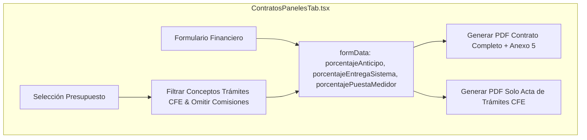

# Estructura de Pagos por Entregable y Acta de Trámites CFE - Plan de Implementación

> **For agentic workers:** REQUIRED SUB-SKILL: Use superpowers:subagent-driven-development to implement this plan task-by-task. Steps use checkbox (`- [ ]`) syntax for tracking.

**Goal:** Permitir dividir el pago restante tras el anticipo en dos hitos (Entrega del Sistema Instalado y Conclusión de Trámites CFE) y generar el documento de Acta / Anexo 5 de Conclusión de Trámites e Interconexión CFE (así como su exportación independiente).

**Architecture:** Se actualizará el estado de `formData` en `ContratosPanelesTab.tsx` para soportar `esquemaTramitesActivo`, los porcentajes/montos de cada entregable y `descripcionTramitesCfe`. Se modificará `handleBudgetSelection` para filtrar automáticamente conceptos de trámites CFE omitiendo comisiones. Se añadirá la plantilla HTML de renderizado e impresión para el Anexo 5 y la función `handleGeneratePdfTramites` para la exportación independiente del Acta de Trámites CFE.

**Architecture Diagram:**



**Tech Stack:** React 19, TypeScript, Tailwind CSS, Lucide React, html2pdf.js

---

### Task 1: Actualizar el estado y lógica financiera de `ContratosPanelesTab.tsx`

**Files:**
- Modify: `src/components/legal/ContratosPanelesTab.tsx:192-230`

- [ ] **Step 1: Agregar campos a `formData` y helpers de cálculo**

Modificar la definición inicial de `formData` para incluir:
```typescript
esquemaTramitesActivo: false,
porcentajeEntregaSistema: 20,
porcentajeEntregaSistemaStr: "20",
montoEntregaSistema: 0,
porcentajePuestaMedidor: 10,
porcentajePuestaMedidorStr: "10",
montoPuestaMedidor: 0,
descripcionTramitesCfe: '',
```

- [ ] **Step 2: Agregar funciones de actualización para los hitos de entrega**

```typescript
const updateHitoPorcentaje = (field: 'entrega' | 'medidor', pct: number, strVal?: string) => {
  const validPct = isNaN(pct) ? 0 : Math.max(0, Math.min(100, pct));
  const newMonto = formData.montoTotal * (validPct / 100);
  if (field === 'entrega') {
    setFormData(prev => ({
      ...prev,
      porcentajeEntregaSistema: validPct,
      porcentajeEntregaSistemaStr: strVal !== undefined ? strVal : validPct.toString(),
      montoEntregaSistema: newMonto
    }));
  } else {
    setFormData(prev => ({
      ...prev,
      porcentajePuestaMedidor: validPct,
      porcentajePuestaMedidorStr: strVal !== undefined ? strVal : validPct.toString(),
      montoPuestaMedidor: newMonto
    }));
  }
};
```

---

### Task 2: Actualizar `handleBudgetSelection` para filtrar Trámites CFE y omitir comisiones

**Files:**
- Modify: `src/components/legal/ContratosPanelesTab.tsx:405-460`

- [ ] **Step 1: Filtrar conceptos de trámites CFE sin comisiones**

```typescript
// Extraer conceptos de trámites e interconexión CFE
const isTramiteCfe = (descStr: string) => {
  const lower = (descStr || '').toLowerCase();
  return lower.includes('trámite') || lower.includes('tramite') ||
         lower.includes('interconexión') || lower.includes('interconexion') ||
         lower.includes('cfe') || lower.includes('medidor') ||
         lower.includes('dictamen') || lower.includes('uvie') || lower.includes('uveg') ||
         lower.includes('expediente') || lower.includes('gestión') || lower.includes('gestion');
};

const tramitesConceptos = leafConceptos.filter((c: any) => isTramiteCfe(c.description));

let tramitesDesc = "";
if (tramitesConceptos.length > 0) {
  tramitesDesc = "GESTIONES Y TRÁMITES ANTE CFE:\n";
  tramitesConceptos.forEach((t: any) => {
    tramitesDesc += `- ${t.quantity} x ${t.description}\n`;
  });
} else {
  tramitesDesc = "TRÁMITES E INTERCONEXIÓN CFE INCLUIDOS:\n" +
    "- Gestión, integración de expediente técnico e ingeniería ante CFE\n" +
    "- Solicitud de interconexión y convenio de interconexión fotovoltaica CFE\n" +
    "- Verificación de requisitos de medición bidireccional y puesta en marcha\n";
}
```

---

### Task 3: Controles de UI en el Formulario Financiero

**Files:**
- Modify: `src/components/legal/ContratosPanelesTab.tsx:1400-1490`

- [ ] **Step 1: Añadir selector de división de pago restante por entregables**

Añadir toggle y campos de porcentaje/monto para "Entrega de Sistema Instalado" y "Conclusión de Trámites y Puesta de Medidor CFE".

- [ ] **Step 2: Campo textarea para `descripcionTramitesCfe`**

Permitir la edición libre de `descripcionTramitesCfe` en el formulario.

---

### Task 4: Plantilla HTML Anexo 5 y Función `handleGeneratePdfTramites`

**Files:**
- Modify: `src/components/legal/ContratosPanelesTab.tsx:860-950` y `1480-1530`

- [ ] **Step 1: Añadir Anexo 5 a la plantilla HTML del contrato completo**

Agregar el bloque del Anexo 5 (Acta de Conclusión de Trámites e Interconexión CFE) al final de la plantilla HTML exportable a PDF.

- [ ] **Step 2: Crear la función `handleGeneratePdfTramites`**

Añadir función de exportación independiente de solo la hoja de Trámites CFE y el botón secundario "Exportar Solo Acta de Trámites CFE (PDF)".

- [ ] **Step 3: Verificar compilación y pruebas locales**

Ejecutar `npx tsc --noEmit` y verificar el funcionamiento local en `http://localhost:5173/`.
